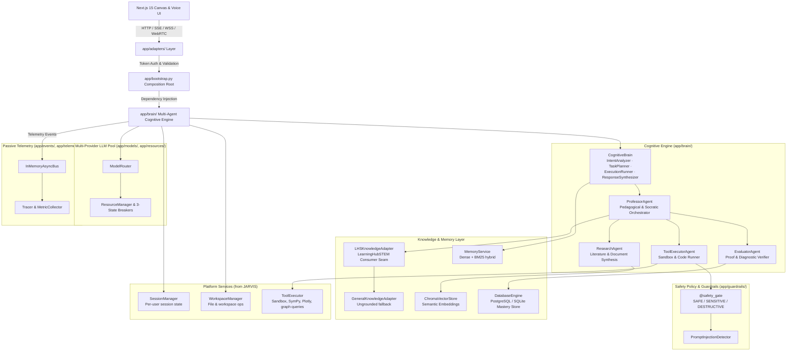
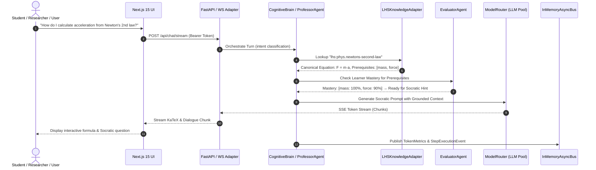

# PROFESSOR-J — System Architecture

> **Architecture Style:** Clean Layered Architecture + Multi-Agent Cognitive Orchestrator +
> Pragmatic Hybrid Async Engine (inherited from JARVIS, upgraded)
> **Status:** Living Architecture at Inception
> **Version:** 0.1.0

---

## 1. Platform positioning

PROFESSOR-J is a **general-purpose autonomous AI platform** (an AI OS) that inherits the
proven architectural foundations of **JARVIS** under a new name and generalizes them.
It is **not bound to LearningHubSTEM**. It consumes LearningHubSTEM as one specialized
knowledge source among others via a consumer adapter, and falls back to general knowledge
where no canonical entity exists.

| JARVIS capability | PROFESSOR-J status |
|---|---|
| Cognitive Brain (Intent→Plan→Execute→Synthesize) | **Inherited, upgraded** with Professor/Research/Evaluator agents |
| `@safety_gate` tiered guardrails | **Inherited** |
| Multi-provider model pool + circuit breakers | **Inherited** |
| Hybrid memory (ChromaDB + BM25) | **Inherited** |
| Session & workspace management | **Inherited** |
| Tool sandbox | **Inherited** |
| FastAPI + Next.js UI | **Inherited** |
| Socratic tutoring, research, pedagogy | **New** (primary domain) |

Integration with JARVIS is **pattern-level only**: PROFESSOR-J never couples to JARVIS at
the package level. Ported code is adapted under this repository's governance and recorded
in `docs/adr/`.

---

## 2. System Topology & Layering

---

## 3. Layer Definitions & Boundary Rules

### 3.1. Presentation Layer (`frontend/`)
- **Technology:** Next.js 15 (App Router), React 19, TypeScript (Strict), Tailwind CSS,
  KaTeX, Plotly/D3, WebRTC Media Stream Client.
- **Role:** Interactive whiteboard, streaming token rendering, voice lecturing HUD,
  diagnostic problem canvas, general chat UI.
- **Rule:** Zero business or pedagogical logic; communicates strictly via REST, SSE, and
  WebSocket endpoints.

### 3.2. Adapters & Transport Layer (`app/adapters/`)
- **Technology:** FastAPI, Uvicorn, WebSockets, WebRTC signaling.
- **Role:** Protocol serialization, Bearer token authentication (`PROFESSOR_API_KEY`),
  SSE stream line buffering, request dispatching.
- **Rule:** Adapters translate external protocols into pure domain calls.

### 3.3. Composition Root (`app/bootstrap.py`)
- `ApplicationContainer` wires all singletons and dependencies; the only place DI wiring
  lives.

### 3.4. Multi-Agent Cognitive Engine (`app/brain/`)
- **`CognitiveBrain`:** The intent→plan→execute→synthesize loop inherited from JARVIS;
  classifies prompts (`DIRECT_CHAT`, `FILE_QUERY`, `TOOL_SEARCH`, `MULTI_STEP`,
  `TUTORIAL`), generates execution plans, runs steps under safety policy, synthesizes
  responses.
- **`ProfessorAgent`:** The tutoring orchestrator. Analyzes student responses, chooses
  pedagogical strategy, coordinates subagents.
- **`ResearchAgent`:** Deep semantic search across ingested papers, formula extraction,
  cited summaries.
- **`EvaluatorAgent`:** Verifies student math steps (SymPy) and assesses code against test
  cases.
- **`ToolExecutorAgent`:** Executes sandboxed tools (Python, SymPy, Plotly, knowledge-graph
  queries).
- **Execution Model:** Direct `async/await` calls for zero-latency execution.

### 3.5. Knowledge & Memory Layer (`app/knowledge/`, `app/memory/`, `app/db/`)
- **`LHSKnowledgeAdapter`:** Consumes `LearningHubSTEM/exports/knowledge.json` for
  canonical definitions, prerequisite trees, equations.
- **`GeneralKnowledgeAdapter`:** Handles non-grounded topics; responses clearly labeled
  ungrounded.
- **`MemoryService`:** Hybrid ChromaDB dense + BM25 sparse retrieval.
- **`DatabaseEngine`:** Learner profiles, transcripts, diagnostic scores, mastery levels in
  SQLite (local) / PostgreSQL (production).

### 3.6. Platform Services (`app/session/`, `app/workspace/`, `app/tools/`)
- **`SessionManager`:** Per-user session state and context continuity.
- **`WorkspaceManager`:** File/workspace operations guarded by safety tiers.
- **`ToolExecutor`:** Sandboxed execution (subprocess, resource caps, timeout watchdog).

### 3.7. Model Routing & Resilience Layer (`app/models/`, `app/resources/`)
- **`ModelRouter`:** Multi-provider load balancer across local and cloud LLM providers.
- **`ResourceManager`:** Tracks TPM/RPM budgets and 3-state circuit breakers
  (`CLOSED`, `OPEN`, `HALF_OPEN`) for automatic failover on 429/503.

### 3.8. Safety & Guardrails Layer (`app/guardrails/`)
- **`@safety_gate`:**
  - `SAFE`: read-only (concept lookup, LaTeX) → auto-approved.
  - `SENSITIVE`: file parsing, web search → policy verified.
  - `DESTRUCTIVE`: code sandbox, file modification, DB resets → mandatory HITL approval.

### 3.9. Telemetry & Events (`app/events/`, `app/telemetry/`)
- **`InMemoryAsyncBus`:** passive pub/sub for background job logs, streaming telemetry,
  token usage metrics.

---

## 4. Data & Request Flow

---

## 5. Architectural Invariants (Non-Negotiable)

1. **Grounded Over Generative:** Factual STEM claims link to canonical LearningHubSTEM IDs;
   non-grounded responses are labeled ungrounded.
2. **Zero Monolithic Dependencies:** `app/domain/` is pure Python 3.11+ dataclasses with
   zero framework dependencies.
3. **Failover Resilience:** No single LLM provider outage can take down a session.
4. **Sandboxed Code Execution:** Code never runs in the host web-server process; it runs in
   an isolated, resource-capped subprocess behind `@safety_gate`.
5. **Independent Peer:** PROFESSOR-J never couples to JARVIS or LearningHubSTEM at the
   package level; integration is via contracts/adapters.
6. **General by Default:** The platform must remain capable of general assistance; education
   and research are primary domains, not exclusive.
