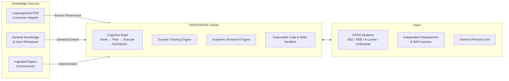

# PROFESSOR-J — Product Requirements Document (PRD)

> **Status:** Draft (Approved for Development)
> **Version:** 0.1.0
> **Owner:** Sajan (Principal Architect)
> **Inherits from:** JARVIS (independent, maintained peer)
> **Date:** August 2026

---

## 1. Executive Summary & Vision

**PROFESSOR-J is a general-purpose autonomous AI platform** — an AI OS that inherits the
proven JARVIS capability surface (cognitive brain, multi-provider model pool with circuit
breakers, hybrid memory, tiered safety gates, tool sandbox, session/workspace management,
FastAPI + Next.js UI) under a new name, and extends it beyond any single domain.

It is **not bound to LearningHubSTEM**. It consumes LearningHubSTEM as one specialized
knowledge source among others via a consumer adapter, and falls back to general knowledge
where no canonical entity exists.

PROFESSOR-J provides source provenance from LearningHubSTEM where canonical entities exist,
interacts through a multimodal tutoring canvas, supports real-time voice discussions,
tracks learner mastery — **and** serves as a general personal AI assistant capable of
handling everyday questions, file/workspace tasks, research, and coding outside that domain.

---

## 2. Target Users & Stakeholders

| Stakeholder / Persona | Needs & Goals | Pain Points with Existing AI | PROFESSOR-J Solution |
|---|---|---|---|
| **STEM Student (High School / College)** | Master Physics, Math, CS; exam prep; instant homework hints. | LLMs hallucinate formulas, give raw answers instead of teaching, lack Socratic guidance. | Socratic tutoring, misconception diagnosis, grounded citations, interactive simulations. |
| **Independent Researcher / Engineer** | Deep-dive research, parse papers, verify derivations, prototype code. | General AI loses context, lacks verified citations, cannot run sandboxed verification. | Literature ingestion, citation provenance, LaTeX proof validation, multi-step research execution. |
| **Educator / Content Creator** | Generate syllabus-aligned lessons, quiz banks, interactive diagrams. | Generic chatbots ignore standardized curricula and educational fitness. | Mapping to curricula (SEE, CBSE, GCSE, NGSS, IB) and LearningHubSTEM entities. |
| **General Personal User** | Everyday AI assistance: questions, files, workspace tasks, code help. | Separate tools for chat/code/research; no unified platform. | One general-purpose platform with JARVIS-class assistant capabilities. |

---

## 3. Key Product Pillars

### Pillar 1: JARVIS-Class Cognitive Engine (inherited, upgraded)
- **Intent Analyzer → Task Planner → Execution Runner → Response Synthesizer** loop.
- Multi-step task planning, HITL approval pauses (`AWAITING_APPROVAL`), execution
  provenance, streaming responses.

### Pillar 2: Socratic & Adaptive Pedagogy
- **Never just give the answer:** diagnose misconceptions and provide progressive hints.
- **Adaptive Difficulty:** adjusts problem complexity from learner mastery metrics.
- **Formative Assessment:** generates targeted diagnostic quizzes.

### Pillar 3: Source Provenance (LearningHubSTEM Consumer)
- Queries [`LearningHubSTEM/exports/knowledge.json`] for definitions,
  prerequisites, equations, concept hierarchies via a consumer adapter.
- Every factual STEM claim that maps to a canonical entity carries source provenance
  including the entity ID (e.g. `lhs:phys.newtons-second-law`) **and the entity's review
  status** (e.g. `status: draft`, `provenance.ai_drafted: true`).
- When no canonical entity exists, the system routes to general knowledge and clearly
  labels the response as ungrounded.

### Pillar 4: Multimodal Interactive Canvas & Voice Classroom
- **Interactive Whiteboard UI:** Next.js 15, KaTeX, Plotly/D3, interactive components.
- **Real-Time Voice Classroom:** WebRTC low-latency audio with VAD.

### Pillar 5: Autonomous Research & Code Sandbox
- **Paper & Document Ingestion:** PDF parse, OCR, chunking, semantic retrieval.
- **Isolated Code & Math Execution:** sandboxed Python/Jupyter, SymPy, Plotly.

### Pillar 6: Resilient Multi-Provider Intelligence Pool
- Expands JARVIS's multi-provider failover routing with 3-state circuit breakers across
  local (Ollama/llama.cpp) and cloud providers (Google AI Studio, Groq, Cerebras, OpenAI,
  Anthropic, OpenRouter).

### Pillar 7: General-Purpose Personal Assistance
- Everyday Q&A, file/workspace operations, session continuity, hybrid memory — the
  general assistant capability inherited from JARVIS, available outside education.

---

## 4. Functional Requirements

### 4.1. Cognitive Engine (`FR-COG`)
- `FR-COG-01`: Classify prompts into intent types (DIRECT_CHAT, FILE_QUERY, TOOL_SEARCH,
  MULTI_STEP, TUTORIAL).
- `FR-COG-02`: Generate structured execution plans with ordered steps; pause for HITL on
  destructive steps.
- `FR-COG-03`: Synthesize responses with step-execution provenance.

### 4.2. Socratic Tutoring Engine (`FR-TUTOR`)
- `FR-TUTOR-01`: Support tutoring modes: **Socratic Mentor**, **Expository Lecture**,
  **Exam Drill**, **Research Advisor**.
- `FR-TUTOR-02`: Track misconception state and formulate targeted scaffolding prompts.
- `FR-TUTOR-03`: Render math in LaTeX and verify step-by-step derivations.

### 4.3. Knowledge Base & Provenance (`FR-KNOW`)
- `FR-KNOW-01`: Import and index LearningHubSTEM entity exports with zero schema drift
  via the consumer adapter; validate `export_version` and `schema_version`.
- `FR-KNOW-02`: Provide prerequisite-graph traversal derived from relationship types
  (`mathematically_requires`, `logically_requires`, `appears_in_law`) — e.g. recommend
  mastering `lhs:phys.mass` and `lhs:phys.acceleration` before `lhs:phys.force`.
- `FR-KNOW-03`: Fall back to general (ungrounded) handling when no canonical entity exists,
  clearly labeled as ungrounded.
- `FR-KNOW-04`: Surface the source entity's review status (`status`, `provenance`) alongside
  every grounded claim so users can assess trust level.

### 4.4. Research & Document Intelligence (`FR-RES`)
- `FR-RES-01`: Ingest scientific PDFs, extract text/formulas/figures, index into ChromaDB.
- `FR-RES-02`: Provide citations with exact page numbers and snippet references.

### 4.5. Code Execution & Tool Sandbox (`FR-SAND`)
- `FR-SAND-01`: Execute Python in an isolated subprocess with timeout and memory limits.
- `FR-SAND-02`: Enforce `@safety_gate` tiers (`SAFE`, `SENSITIVE`, `DESTRUCTIVE`) with
  Human-in-the-Loop approvals.

### 4.6. Voice & Streaming Workspace (`FR-VOICE`)
- `FR-VOICE-01`: Full-duplex WebRTC/WebSocket voice with VAD.
- `FR-VOICE-02`: Stream text and canvas updates via SSE.

### 4.7. Memory & Continuity (`FR-MEM`)
- `FR-MEM-01`: Hybrid retrieval (ChromaDB dense + BM25 sparse) across sessions.
- `FR-MEM-02`: Session continuity so context survives across turns.

### 4.8. Session & Workspace Management (`FR-WORK`)
- `FR-WORK-01`: Per-user session management with bounded context.
- `FR-WORK-02`: Workspace file operations guarded by safety tiers.

---

## 5. Non-Functional Requirements

| Metric | Requirement |
|---|---|
| **First Token Latency (Streaming)** | ≤ 400 ms (cloud fast), ≤ 800 ms (local 8B) |
| **Voice Roundtrip Latency** | ≤ 650 ms endpoint-to-endpoint |
| **Code Execution Sandbox** | Hard timeout 10 s; max memory 512 MB |
| **Test Coverage** | ≥ 95% core domain/brain, ≥ 85% adapters |
| **Availability & Failover** | Automatic circuit-breaker failover within 200 ms on 429/503 |

---

## 6. Success Metrics & KPIs

1. **Pedagogical Resolution Rate:** ≥ 85% of tutoring sessions conclude with the learner
   independently solving the target problem.
2. **Provenance Coverage:** 100% of foundational STEM claims carry source provenance
   (entity ID + review status); ungrounded responses are explicitly labeled.
3. **System Uptime & Failover:** 99.9% uptime across multi-provider LLM pools.
4. **Platform parity:** ≥ 90% of JARVIS capabilities operational in PROFESSOR-J by
   the end of Phase 4 (platform parity), with the balance documented as migrated.

---

## 7. Non-Goals (explicitly deferred / out)

- Multi-tenancy / user accounts-as-a-service (single-tenant personal platform first).
- Payments, billing, or commercial SaaS infrastructure.
- Mobile native apps (web-first, responsive).
- Guaranteed factual accuracy for arbitrary non-grounded topics (labeled
  ungrounded instead); LearningHubSTEM content is consumed as-is with its review status
  surfaced, not independently validated.
- Full offline model serving (local models are one provider option, not the default).

[LearningHubSTEM]: /home/sajan/Projects/LearningHubSTEM
[`LearningHubSTEM/exports/knowledge.json`]: /home/sajan/Projects/LearningHubSTEM/exports/knowledge.json
